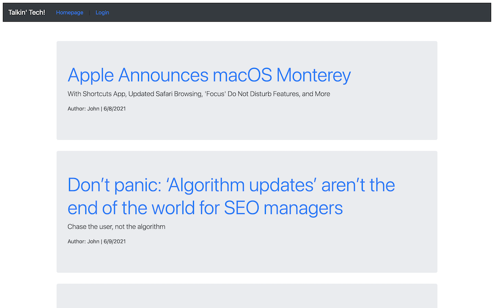
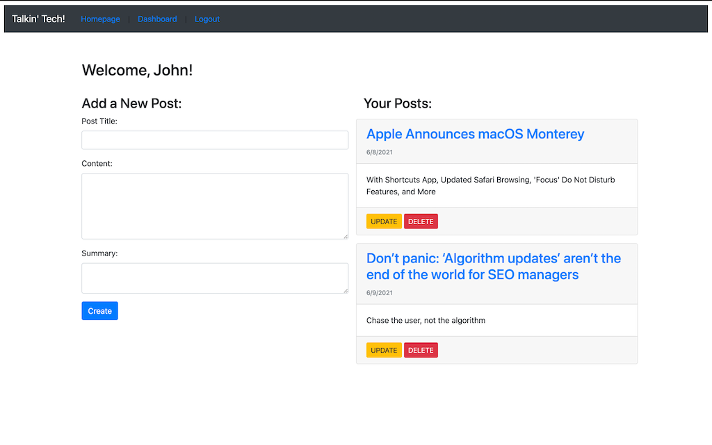

# Talkin' Tech

A CMS-Style Tech Blog

## Deployment

Talkin' Tech has been deployed on Heroku [(https://desolate-reef-25794.herokuapp.com/](https://desolate-reef-25794.herokuapp.com/)

## Technologies

- Node.js, using Express, Express Sessions, Sequelize, Handlebars, BCrypt, dotenv & JAWSDB

## Description

Talkin' Tech is a CMS style Blog with the ability for multiple authors to write posts as well as comment on them.

## What We Did

Talkin' Tech was built with a MVC structure, featuring multiple routes for POST, GET, PUT & DELETE calls for the three models: User, Post & Comment and displayed in multiple views. The site also times out after 5 minutes of inactivity.

## Screenshot

